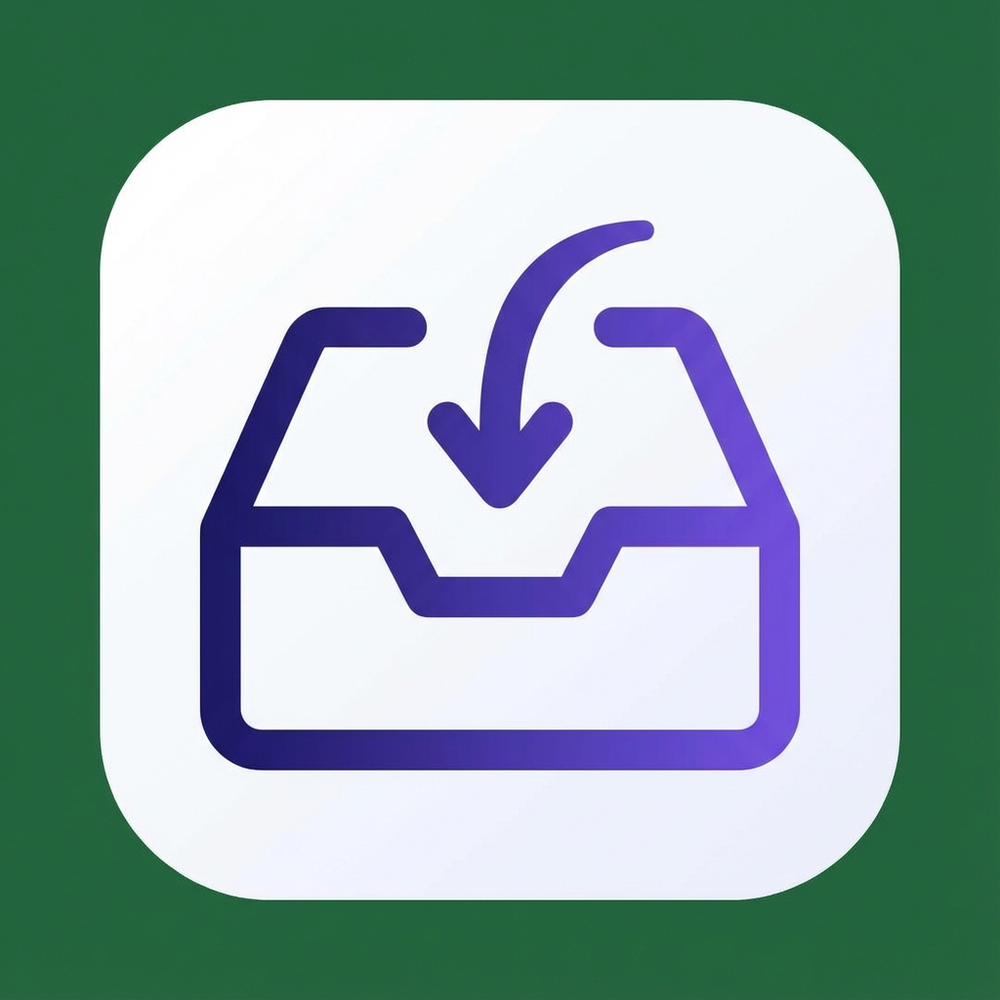

# Stash - Tab Session Manager



Save and restore browser tab sessions with AI-powered naming.

## Features

🚀 **One-Click Tab Saving** - Save all your open tabs instantly  
🤖 **AI-Powered Naming** - Smart session names using Ollama (local) or Claude API  
📂 **Session Management** - Search, rename, delete, and preview sessions  
🔄 **Flexible Restore** - Open in new window or current window  
⌨️ **Keyboard Shortcuts** - Quick access with customizable shortcuts  
💾 **Export/Import** - Backup and transfer your sessions  
🌙 **Dark Mode** - Automatic system theme support  

## Installation

### From Chrome Web Store
*(Coming soon - pending review)*

### From Source
1. Clone this repository
2. Run `npm install`
3. Run `npm run build`
4. Open Chrome and go to `chrome://extensions`
5. Enable "Developer mode"
6. Click "Load unpacked" and select the `dist` folder

## AI Features

### Ollama (Recommended - 100% Local)
1. Install [Ollama](https://ollama.ai)
2. Start with CORS enabled: `OLLAMA_ORIGINS="*" ollama serve`
3. Enable AI naming in Stash settings

### Claude API
1. Get an API key from [Anthropic](https://console.anthropic.com)
2. Enter your API key in Stash settings
3. Only tab titles are sent - URLs and content stay private

## Development

```bash
# Install dependencies
npm install

# Development mode with hot reload
npm run dev

# Build for production
npm run build

# Type check
npm run lint
```

## Tech Stack

- React 18 + TypeScript
- Tailwind CSS
- Zustand (state management)
- Vite + CRXJS (build tooling)
- Chrome Extension Manifest V3

## Privacy

- All session data is stored locally in your browser
- Ollama AI runs entirely on your machine
- Claude API only receives tab titles (not URLs or content)
- No tracking, analytics, or ads

See [PRIVACY_POLICY.md](PRIVACY_POLICY.md) for full details.

## License

MIT
